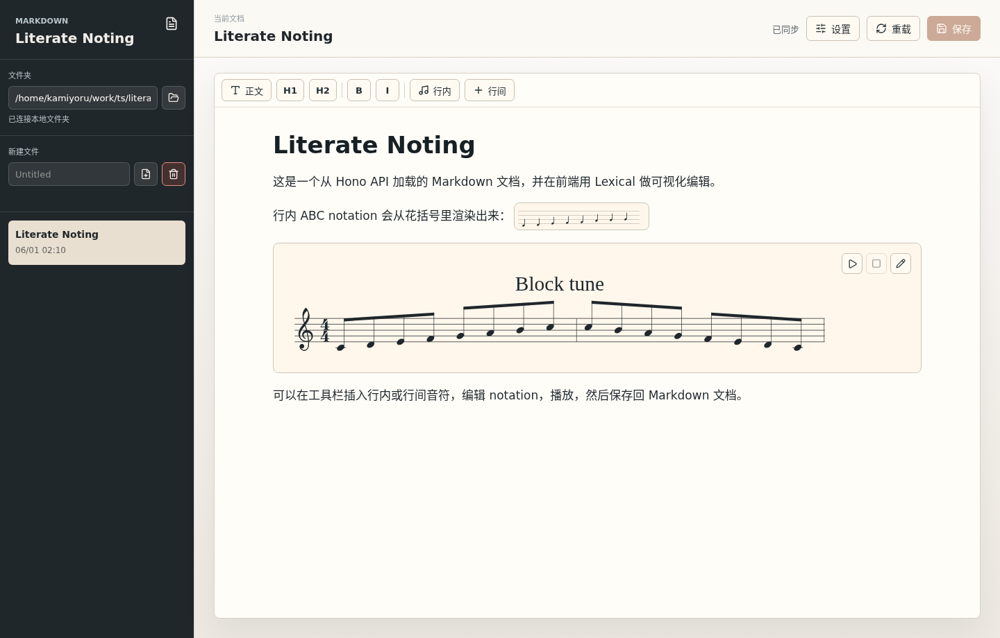

# Literate Noting

Literate Noting 是一个 local-first 的可视化 Markdown 笔记编辑器。它用
React 和 Lexical 构建编辑体验，用 Hono 提供可选的本地后端，并把 ABC
notation 渲染成可以播放的音符。

English documentation: [README.md](README.md).

## 功能

- 可视化编辑 Markdown，显式保存时导出 Markdown。
- 行内 ABC notation：`{C D E F | G A B c}` 会直接显示成音符。
- 行间 ABC notation：支持 ```` ```abc note ```` 代码块并渲染乐谱。
- 音符可播放，钢琴音色可在设置面板中切换。
- 可选择本地 Markdown 文件夹，路径输入框支持 autocomplete。
- 支持新建、删除、重载和保存 Markdown 文件。
- 设置遵守 XDG，默认写入 `~/.config/literate-noting/settings.json`。
- 前端默认写入 localStorage 和 IndexedDB；没有后端时也能作为静态 UI 使用。
- GitHub Pages 只部署前端，文件系统能力在无后端环境下自动降级为浏览器存储。

## 截图



## 安装与运行

需要 Node.js 22+ 和 pnpm 10。

```sh
pnpm install
pnpm dev
```

打开：

```text
http://127.0.0.1:5173
```

`pnpm dev` 会启动两个服务：

- Vite 前端：`http://127.0.0.1:5173`
- Hono 后端：`http://127.0.0.1:8787`

## 使用

- 在左侧文件夹输入框中输入路径，选择 autocomplete 结果，点击文件夹按钮打开。
- 在“新建文件”输入框输入标题，点击新建按钮创建 Markdown 文件。
- 选择文档后编辑内容，按 `Ctrl+S` 保存。
- 点击设置按钮切换钢琴音色。
- 点击删除按钮删除当前文档。

## Markdown 音符语法

行内音符：

```md
Inline melody: {C D E F | G A B c}
```

行间音符：

````md
```abc note
X:1
T:Block tune
M:4/4
L:1/8
K:C
CDEF GABc | cBAG FEDC |
```
````

## 静态部署

GitHub Pages 只构建并部署前端。没有 Hono 后端时，本地文件夹选择和文件系统写入不可用，但应用仍会使用 localStorage 和 IndexedDB 保存内容。

仓库子路径部署时设置 `BASE_PATH`：

```sh
BASE_PATH=/literate-noting/ pnpm --filter literate-noting build:client
```

## 验证

```sh
pnpm typecheck
pnpm build
```
